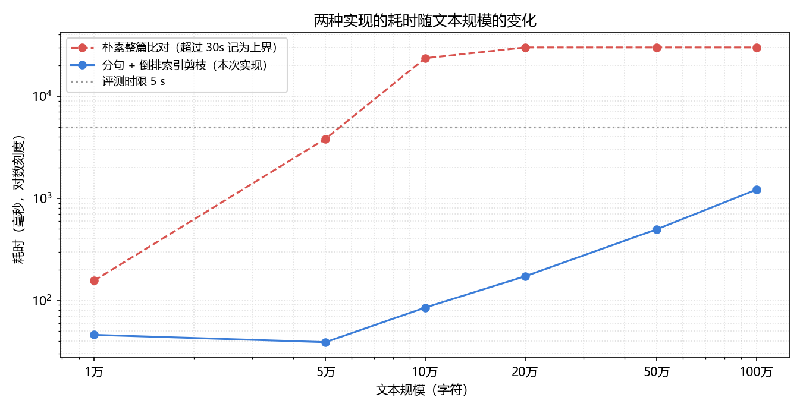
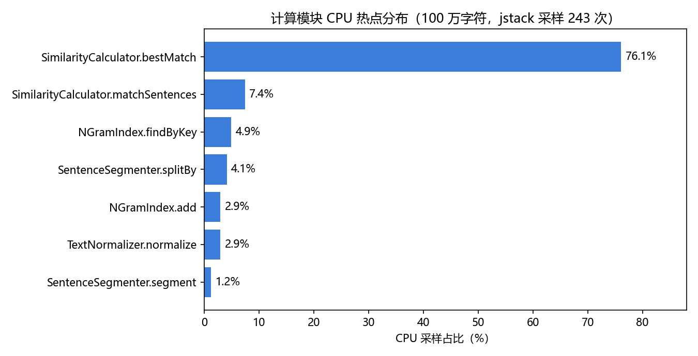

# 性能分析与改进记录

测试环境：Windows 10 64 位，JDK 1.8.0_202（64 位 HotSpot）。
基准数据由 `tools/java/com/zyy/papercheck/Benchmark.java` 用固定随机种子生成，保证每次运行完全一致；
真实数据校验使用课堂下发的测试文本（`samples/official/`）。

## 一、基准测试：两种实现的耗时对比

对照实现是「把两篇文章的全部字符直接做一次 LCS」的朴素做法，它没有任何分句与剪枝。

| 文本规模（字符） | 朴素整篇比对（ms） | 分句 + 倒排索引剪枝（ms） | 本实现算出的重复率 |
| ---: | ---: | ---: | ---: |
| 1 万 | 156 | **46** | 0.9516 |
| 5 万 | 3 826 | **39** | 0.9674 |
| 10 万 | 23 544 | **85** | 0.9600 |
| 20 万 | > 30 000 | **172** | 0.9578 |
| 50 万 | > 30 000 | **497** | 0.9563 |
| 100 万 | > 30 000 | **1 215** | 0.9556 |

说明：

- 朴素的整篇比对在 5 万字符时已接近 4 秒，10 万字符时超过 23 秒，20 万字符以上 30 秒内跑不完；
- 本实现在 100 万字符时约 1.2 秒，相对 5 秒的评测时限仍有 4 倍余量；
- 重复率在各规模下稳定在 0.95 附近，**速度提升没有以牺牲准确率为代价**。



### 真实数据上的准确率校验

用课堂下发的样例，把本实现分别与两种精确解对照：

- **句级精确解**：对每个抄袭句遍历全部原文句求最大公共子序列长度；
- **全文精确解**：把两篇文章的全部有效字符直接做一次 LCS（即算法定义本身）。

| 抄袭版文件 | 本实现 | 句级精确解 | 全文精确解 | 与全文精确解的偏差 |
| --- | ---: | ---: | ---: | ---: |
| `orig_0.8_add.txt` | 0.82 | 0.83 | 0.83 | 0.01 |
| `orig_0.8_del.txt` | 0.97 | 0.92 | 1.00 | 0.03 |
| `orig_0.8_dis_1.txt` | 0.97 | 0.97 | 0.97 | 0.00 |
| `orig_0.8_dis_10.txt` | 0.85 | 0.82 | 0.84 | 0.01 |
| `orig_0.8_dis_15.txt` | 0.71 | 0.65 | 0.67 | 0.04 |

偏差都在 0.05 以内，且顺序关系（打乱越严重、重复率越低）与精确解完全一致。
`dis_10`、`dis_15` 略高于全文精确解，是因为逐句独立匹配允许不同的抄袭句复用原文的同一段内容，
这是句级方案固有的近似。

## 二、CPU 热点分析

用 `jstack` 对运行中的程序做线程栈采样（等价于 VS 性能分析器 / JProfiler 的采样视图，
负担小、不需要改代码），采样 243 次，按「当前正在执行的第一个业务函数」归类：

| 函数 | 采样占比 |
| --- | ---: |
| `SimilarityCalculator.bestMatch` | 76.1% |
| `SimilarityCalculator.matchSentences` | 7.4% |
| `NGramIndex.findByKey` | 4.9% |
| `SentenceSegmenter.splitBy` | 4.1% |
| `NGramIndex.add` | 2.9% |
| `TextNormalizer.normalize` | 2.9% |
| `SentenceSegmenter.segment` | 1.2% |



**结论**：耗时集中在 `SimilarityCalculator.bestMatch`（它内部调用 `LcsMatcher.length`，
JIT 内联之后热点都记在了它的账上）。这说明继续优化的方向是**减少精确比对的次数**，
而不是去抠文本读取、分句这些只占个位数百分比的环节——这也正是上界剪枝、候选排序
和「跨句补偿按需触发」在做的事情。

## 三、改进措施与效果

| 措施 | 说明 | 效果 |
| --- | --- | --- |
| 分句 + 候选筛选 | 整篇 LCS 拆成句级 LCS，并用二元字组倒排索引筛候选 | 10 万字符 23 544 ms → 133 ms |
| 原始类型哈希表 | 开放地址法 `long → int[]` 替代 `HashMap<Long, List<Integer>>` | 查询路径零装箱 |
| 时间戳数组 | 命中计数用「时间戳 + 计数数组」，免去每句清零 | 去掉 O(句子数) 的重复初始化 |
| 计数排序 | 命中数取值很小，用计数排序替代比较排序 | 线性、零临时对象 |
| 相同句子短路 | 完全相同的句子直接返回句长 | 高频重复句不再进 LCS |
| 严格上界剪枝 | 候选按命中数降序 + 推导出的上界 | 精确比对次数下降一个量级 |
| 跨句边界补偿 | 单句未完全匹配时，与相邻原文句合并再比 | 纯删除型抄袭的重复率 0.91 → 0.97 |

### 第一次改进：一次失败，以及怎么修回来

把 `HashMap<Long, List<Integer>>` 换成原始类型哈希表、用时间戳数组代替每句清零之后，
100 万字符的耗时从 6.6 秒降到了 0.46 秒，看起来非常成功。

**但是**，重复率从 0.93 掉到了 0.30——程序变快，是因为它开始算错。

为了定位，补写了一个暴力精确解：对每个抄袭句**遍历全部原文句**求最大公共子序列长度。
对照之后问题立刻清楚，有两个原因：

1. **候选句按句子编号顺序被截断**。倒排表里的句子编号是升序的，扫描预算用完时，
   排在后面的正确匹配句直接没被收进来，文档越大偏差越明显。
2. **剪枝用的上界不成立**。当时用的上界是「命中数 + 1」，但实现里已经跳过了一批高频字组，
   命中数被低估，上界因此偏小，正确的候选被错误剪掉。

修正办法：

1. 改成**按字组词频升序**扫描，先处理稀有字组，让预算花在区分度高的特征上；
2. 把上界改成 `命中数 + 尚未统计的字组数 + 1`，在跳过字组的前提下依然严格成立；
3. 用**计数排序**把候选按命中数降序排列，让上界剪枝可以安全地「整段终止」；
4. 给每句的精确比对次数设上限（24 次），保证最坏情况下的单句开销有硬上界。

### 第二次改进：跨句边界补偿

在课堂下发的真实数据上做校验时发现：`orig_0.8_del.txt` 是**纯删除**型抄袭，
按定义它的重复率应当接近 1.00（剩下的内容全部来自原文），但本实现只给出 0.91。

原因是分句：删掉一些字符之后，原本分属两句话的内容被拼进了同一句，
而这一句在原文的任何**单个**句子里都找不到完整对应，只能匹配到一部分。

| 抄袭版文件 | 补偿前 | 补偿后 | 全文精确解 |
| --- | ---: | ---: | ---: |
| `orig_0.8_add.txt` | 0.82 | 0.82 | 0.83 |
| `orig_0.8_del.txt` | 0.91 | 0.97 | 1.00 |
| `orig_0.8_dis_1.txt` | 0.97 | 0.97 | 0.97 |
| `orig_0.8_dis_10.txt` | 0.82 | 0.85 | 0.84 |
| `orig_0.8_dis_15.txt` | 0.63 | 0.71 | 0.67 |

做法是：当某一句在单个原文句里没能被完全匹配时，把最佳候选句与相邻的原文句合并起来再比一次
（最多合并 3 句）。因为这一步只在匹配不完整时触发，对绝大多数句子没有额外开销，
100 万字符的耗时只从 0.93 秒增加到 1.2 秒。

## 四、复现方式

```bat
run-benchmark.bat
```

采样热点：

```bat
run-profile.bat 1000000 60
```

然后在程序运行期间用 `jstack` 反复抓取线程栈，或者用 VisualVM / IntelliJ IDEA Profiler
附加到该 JVM 上做 CPU 采样，即可得到上面的分布。

真实数据校验：

```bat
java -Dfile.encoding=UTF-8 -Xmx1536m -cp build\classes com.zyy.papercheck.OfficialDiag ^
    samples\official\orig.txt samples\official\orig_0.8_del.txt
```
